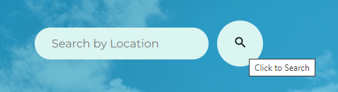
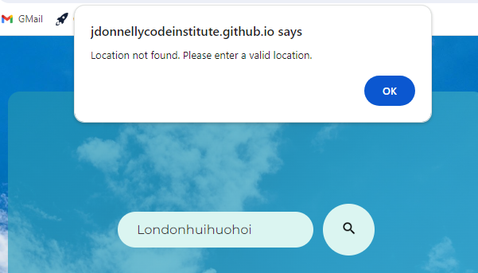

weather icons taken from https://www.iconfinder.com/
walkthrough guidance from https://www.youtube.com/watch?v=MIYQR-Ybrn4
pexels for background image https://www.pexels.com/photo/cloudy-sky-531756/
google fonts for font https://fonts.google.com/

#World Wide Weather

World Wide Weather is a simple web app that allows users to make API calls that feedback the temperature, condition, humidity and wind-speed of a location of their choice. Points of importance will increase in size and display a title with extra information when the user hovers over them with their mouse.

## The Five Planes of User Experience

- __The Strategy Plane__
  - Defining Goals and User Needs:
    - Our goal is to provide a user friendly web app that allows users to search by location for various weather factors including wind speed, humidity and temperature.
    - User needs are clear aesthetically pleasing presentation of the required information, easy and logical site navigation, such as use of the search bar, and some interactivity.

- __The Scope Plane__
  - Determining Features and Content:
    - The main tool for the user is the search bar and search button. They can input a location, as the placeholder text suggests, and search by clicking the button or by hitting enter. A method is called to add their input to the API call that requests the weather data as a JSON. If they search for something that is not a recognised location they will receive an alert stating "Location not found. Please enter a valid location."
    - Upon a successful search the user will see an image relevant to the weather condition stipulated in the JSON, the temperature, the humidity and the windspeed.
    - The user can hover over the icons for search, weather condition, humidity and windspeed and a string of additional information will appear on screen.
    - There is a visually appealing background image of the sky.

- __The Structure Plane__
  - Setting the Sitemap:
    - Search Bar and Button - Set at the highest point of the user interface for ease of use.
    - Weather Icon and Temperature - Largest and most relevant information in the centre of the screen.
    - Sub-data - Humidity and Windspeed sections smaller housed low to left and right of centre.

- __The Skeleton Plane__
  - Layout and navigation design plan across device types:

    [Wireframe Desktop](assets/images/wireframe-laptop.png)
    [Wireframe Tablet](assets/images/wireframe-tablet.png)
    [Wireframe Mobile](assets/images/wireframe-mobile.png)

- __The Surface Plane__
  - The Visual Design:
    - The focus area is a cool blue-gradient reminiscent of the sky and is translucent so the user can see the attractive background image.
    - The font is Montserrat taken from google docs, it is simple, clear and attractive. The colour contrasts well with the background.
    - The condition images are clear and show an array of weather conditions through simple icons.

## Features

- __Search Bar__

  - The search bar takes user input in the form of a location, when the user initiates a search by hitting enter or clicking on the search button the interactive area of the page will display the weather details of the location the user has searched. Except in cases where the input is not a valid location in which case the user will get an alert to say so.
  - The user is guided on the required info by the placeholder text, when they hover over the search button, the button will increase in size and a line of text will pop up that says 'Click to search'.

- __Weather Icon, Temperature and Location__ 

  - The weather icon changes depending on the condition field in the weather data pulled from the JSON.
  - When the user hovers over the weather icon it increases in size and a line of text appears on screen stating the current weather condition.
  - Temperature is the largest text on the page as the most important written data.
  - The location data is being presented for can be seen just under the temperature.

